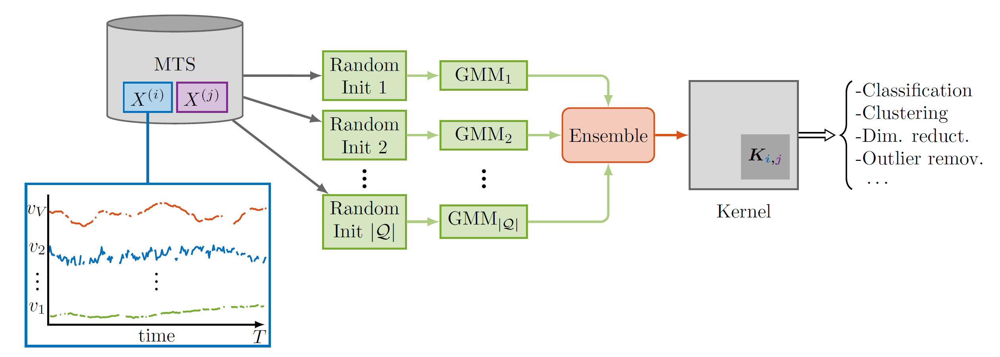

[](https://arxiv.org/abs/1704.00794)

The Time Series Cluster Kernel (TCK) is a kernel similarity for multivariate time series with missing values. The kernel can be used to perform tasks such as classification, clustering, and dimensionality reduction.


<p align="center">

<br>

TCK is based on an ensemble of Gaussian Mixture Models for time series that use informative Bayesian priors robust to missing values. The similarity between two time series is proportional to the number of times the two time series are assigned to the same mixtures.


# Installation

The recommended installation is with pip:

````bash
pip install tck
````

Alternatively, you can install the library from source:
````bash
git clone https://github.com/FilippoMB/https://github.com/FilippoMB/Time-Series-Cluster-Kernel.git
cd https://github.com/FilippoMB/Time-Series-Cluster-Kernel
pip install -e .
````

# Quick start

The following scripts provide minimalistic examples that illustrate how to use the library for different tasks.

To run them, download the project and cd to the root folder:

````bash
git clone https://github.com/FilippoMB/https://github.com/FilippoMB/Time-Series-Cluster-Kernel.git
cd https://github.com/FilippoMB/Time-Series-Cluster-Kernel
````

**Classification**

````bash
python examples/classification.py
````

**Clustering**

````bash
python examples/clustering.py
````

The following notebooks illustrate more advanced use-cases.

- Perform time series dimensionality reduction, cluster analysis, and visualize the results: [view](https://nbviewer.org/github/FilippoMB/Time-Series-Cluster-Kernel/blob/main/notebooks/clustering.ipynb) or [](https://colab.research.google.com/drive/1hLF0SfiZZ13zhik0vAjWfvs__GJvV9c4?usp=sharing)

## Running on Windows

TCK uses multiprocessing. While using multiprocessing in Python on windows, it is necessary to protect the entry point of the program by using 

```python
if __name__ == '__main__':
```

Please, refer to the following examples.

**Classification**

````bash
python examples/classification_windows.py
````

**Clustering**

````bash
python examples/clustering_windows.py
````

# Datasets

**Data format**
- TCK works both with univariate and multivariate time series. The dataset must be stored in a numpy array of shape `[N, T, V]`, where `N` is the number of variables, `T` is the number of time steps, and `V` is the number of variables (`V=1` in the univariate case). 
- If the time series in the same dataset have a different number of time steps, `T` corresponds to the maximum length of the time series in the dataset.
All the time series shorter than `T` should be padded with trailing zeros to match the dimension `T`. Alternatively, one can use interpolation to stretch the shorter time series up to length `T`.
- The time series can contain missing data. Missing data dare indicated by entries `np.nan` in the data array.

**Available datasets**

There are several univariate and multivariate time series classification datasets immediately available for test and benchmarking purposes.

To list of available datasets can be retrieved as follows
````python
from tck.datasets import DataLoader
downloader.available_datasets(details=True) # Leave at False to just get the names
````

A dataset can be loaded as follows
````python
Xtr, Ytr, Xte, Yte = downloader.get_data('Japanese_Vowels')
````

# Configuration and detailed usage

There are few hyperparameters that can be tuned to modify the TCK behavior.

````python
tck = TCK(G, C)
````
- `G` is the number of GMMs.
- `C` is the number of components in the GMMs.

Usually, the higher the better but the computations take longer.

````python
tck.fit(X, minN, minV, maxV, minT, maxT, I)
````

`minN`: Minimum percentage of samples to be used in the training of the GMMs.
`minV`: Minimum number of attributes to be sampled from the dataset.
`maxV`: Maximum number of attributes to be sampled from the dataset.
`minT`: Minimum length of time segments to be sampled from the dataset.
`maxT`: Maximum length of time segments to be sampled from the dataset.
`I`: Number of iterations for the MAP-EM algorithm.

These parameters are usually less sensitive and can be left to their default value in most cases.

````python
Ktr = tck.predict(mode='tr-tr')
Kte = tck.predict(Xte=Xte, mode='tr-te')
````
- If `mode='tr-tr'`, returns the similarity matrix between training samples, i.e., `Ktr[i,j]` is the similarity between time series `i` and `j` in the training set.
- If `mode='tr-te'`, it is necessary to pass the test set `Xte` as additional imput. The returned similarity matrix `Kte[i,j]` is the similarity between time series `i` in the test set and time series `j` in the training set.


# Citation

Please, consider citing the original paper if you are using TCK in your reasearch.

````bibtex
@article{mikalsen2018time,
  title={Time series cluster kernel for learning similarities between multivariate time series with missing data},
  author={Mikalsen, Karl {\O}yvind and Bianchi, Filippo Maria and Soguero-Ruiz, Cristina and Jenssen, Robert},
  journal={Pattern Recognition},
  volume={76},
  pages={569--581},
  year={2018},
  publisher={Elsevier}
}
````
